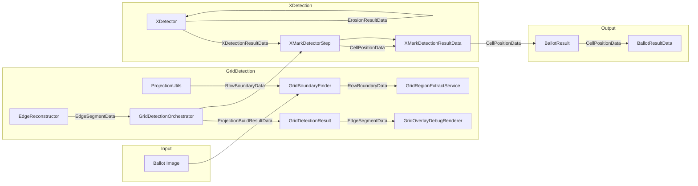

# PairData Refactoring Plan

## Problem

`PairData<T, U>` is a generic implementation detail that was introduced during Kotlin-to-Java conversion to mimic Kotlin's `Pair` type. It obscures business meaning — for example, `PairData<Integer, Integer>` could represent a cell position (row, col), a grid edge (start, end), or a crop boundary (top, bottom). The test failure at `BallotTestExecutor.java:47` shows this concretely: `PairData[first=0, second=2]` is compared against expected `0=2`, and the `toString()` representation leaks the implementation type.

## Solution

Replace each distinct usage of `PairData` with a dedicated, business-meaningful record type. This makes the code self-documenting, improves type safety, and fixes the `toString()` comparison issue.

## New Record Types

### 1. `CellPositionData` — for X-mark cell positions
- **Package:** `hu.kdea.szavazas.ballotprocessor.common`
- **Fields:** `int row, int col`
- **Replaces:** `PairData<Integer, Integer>` in `BallotResult`, `BallotResultData`, `XMarkDetectionResultData`, `XMarkDetectorStep`
- **`toString()`:** `"row=col"` format (e.g., `"0=2"`) matching the expected test format

### 2. `EdgeSegmentData` — for grid edge start/end pixel pairs
- **Package:** `hu.kdea.szavazas.ballotprocessor.common`
- **Fields:** `int start, int end`
- **Replaces:** `PairData<Integer, Integer>` in `GridDetectionResult`, `EdgeReconstructor`, `AxisPeaks`, `GridDetectionOrchestrator`, `GridOverlayDebugRenderer`, `ProjectionDebugRenderer`

### 3. `RowBoundaryData` — for crop top/bottom boundaries
- **Package:** `hu.kdea.szavazas.ballotprocessor.common`
- **Fields:** `int cropTop, int cropBottom`
- **Replaces:** `PairData<Integer, Integer>` in `GridBoundaryFinder`, `ProjectionUtils`, `GridDetectionOrchestrator`, `GridRegionExtractService`

### 4. `XDetectionResultData` — for X detection result with debug info
- **Package:** `hu.kdea.szavazas.ballotprocessor.x`
- **Fields:** `boolean detected, CellDebugData debug`
- **Replaces:** `PairData<Boolean, CellDebugData>` in `XDetector`, `XMarkDetectorStep`

### 5. `ErosionResultData` — for erosion operation result
- **Package:** `hu.kdea.szavazas.ballotprocessor.x`
- **Fields:** `GrayU8 processed, GrayU8 eroded`
- **Replaces:** `PairData<GrayU8, GrayU8>` in `XDetector`

### 6. `ProjectionBuildResultData` — for projection build result
- **Package:** `hu.kdea.szavazas.ballotprocessor.grid`
- **Fields:** `RectangleData roi, ProjectionData data`
- **Replaces:** `PairData<RectangleData, ProjectionData>` in `GridDetectionOrchestrator`

## Affected Files (in execution order)

### Step 1: Create new record types (6 new files)
1. `szavazas-core/src/main/java/hu/kdea/szavazas/ballotprocessor/common/CellPositionData.java`
2. `szavazas-core/src/main/java/hu/kdea/szavazas/ballotprocessor/common/EdgeSegmentData.java`
3. `szavazas-core/src/main/java/hu/kdea/szavazas/ballotprocessor/common/RowBoundaryData.java`
4. `szavazas-core/src/main/java/hu/kdea/szavazas/ballotprocessor/x/XDetectionResultData.java`
5. `szavazas-core/src/main/java/hu/kdea/szavazas/ballotprocessor/x/ErosionResultData.java`
6. `szavazas-core/src/main/java/hu/kdea/szavazas/ballotprocessor/grid/ProjectionBuildResultData.java`

### Step 2: Update production code files (12 files)
7. `BallotResult.java` — change `List<PairData<Integer, Integer>>` → `List<CellPositionData>`
8. `BallotResultData.java` — same
9. `XMarkDetectionResultData.java` — same
10. `XMarkDetectorStep.java` — change return type and `marks.add()` to use `CellPositionData`
11. `XMarkDetectionAndResultService.java` — update type references
12. `GridDetectionResult.java` — change to `List<EdgeSegmentData>`
13. `EdgeReconstructor.java` — change return types to `List<EdgeSegmentData>`
14. `AxisPeaks.java` — change field type to `List<EdgeSegmentData>`
15. `GridDetectionOrchestrator.java` — update all PairData usages to new types
16. `GridBoundaryFinder.java` — return `RowBoundaryData`
17. `ProjectionUtils.java` — return `RowBoundaryData`
18. `GridRegionExtractService.java` — use `RowBoundaryData`
19. `XDetector.java` — use `XDetectionResultData` and `ErosionResultData`

### Step 3: Update debug renderers (2 files)
20. `GridOverlayDebugRenderer.java` — use `EdgeSegmentData`
21. `ProjectionDebugRenderer.java` — use `EdgeSegmentData`

### Step 4: Update test code (1 file)
22. `BallotTestExecutor.java` — compare with `CellPositionData` instead of `Map.Entry`

### Step 5: Cleanup (1 file)
23. Delete `PairData.java`

### Step 6: Verify
24. Run `./gradlew :szavazas-core:test` to verify all tests pass

## Data Flow Diagram



## Test Assertion Fix

The test at `BallotTestExecutor.java:47` currently does:
```java
Assert.assertEquals("X marks", expectedXMarks, new HashSet<>(actualResult.xCells()));
```
where `expectedXMarks` is `Set<Map.Entry<Integer, Integer>>` and `actualResult.xCells()` is `List<PairData<Integer, Integer>>`.

After the refactoring, `actualResult.xCells()` will be `List<CellPositionData>`. The test should be updated to:
```java
Set<CellPositionData> expected = extractXMarks(jsonString);  // returns Set<CellPositionData>
Assert.assertEquals("X marks", expected, new HashSet<>(actualResult.xCells()));
```

The `CellPositionData` record's `equals()`/`hashCode()` (auto-generated by the record) will handle comparison correctly, and its `toString()` will produce `"CellPositionData[row=0, col=2]"` or similar readable format.
