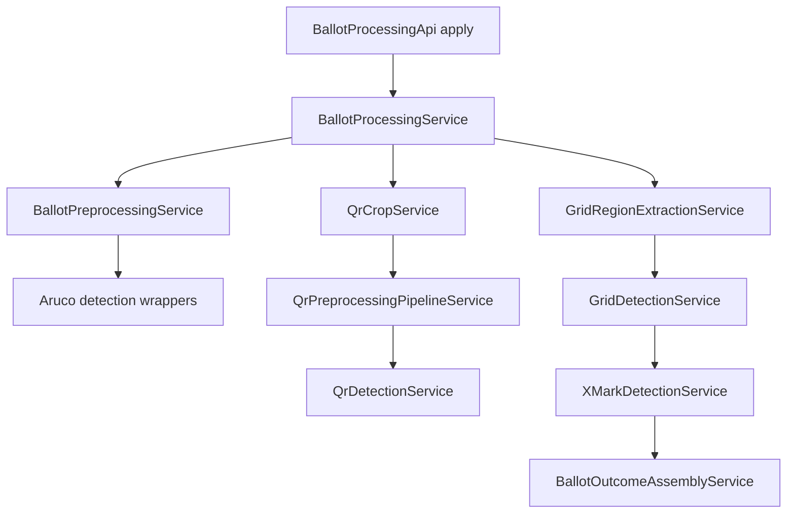

# szavazas-core compliance refactor architecture spec

## Goal
Refactor production code under [`szavazas-core/src/main/java`](../szavazas-core/src/main/java) to comply with [`AGENTS.md`](../AGENTS.md:1), especially:
- logic only in `*Service` units with exactly one public [`apply`](../AGENTS.md:1) method
- external library and I/O access isolated in `*Wrapper` units
- constants moved to `*Constants` interfaces
- immutable payloads represented by `record` types ending with `Data`
- framework integration expressed as Glue units
- constructor injection with [`@Inject`](../szavazas-core/src/main/java/hu/kdea/szavazas/ballotprocessor/qr/preprocess/MorphologicalClosingService.java:10)
- elimination of callback-based business APIs, reflection wiring, and singleton-style static state

## Architectural principles for this refactor
1. Keep one stable top-level ballot-processing boundary for consumers.
2. Replace callback-driven flows with direct-return immutable outcome data.
3. Split each multi-responsibility class into small service slices.
4. Move BoofCV, ZXing, image rendering, and file/debug output into wrappers.
5. Preserve algorithm behavior first, then improve naming and structure.
6. Allow temporary compatibility Glue around old public interfaces only during migration.

## Target package structure
- [`hu/kdea/szavazas/ballotprocessor`](../szavazas-core/src/main/java/hu/kdea/szavazas/ballotprocessor)
  - top-level ballot orchestration services, data, constants, glue
- [`hu/kdea/szavazas/ballotprocessor/aruco`](../szavazas-core/src/main/java/hu/kdea/szavazas/ballotprocessor/aruco)
  - marker detection wrappers and services
- [`hu/kdea/szavazas/ballotprocessor/common`](../szavazas-core/src/main/java/hu/kdea/szavazas/ballotprocessor/common)
  - common data, wrappers, and tiny services
- [`hu/kdea/szavazas/ballotprocessor/debug`](../szavazas-core/src/main/java/hu/kdea/szavazas/ballotprocessor/debug)
  - debug-output wrappers and render services
- [`hu/kdea/szavazas/ballotprocessor/grid`](../szavazas-core/src/main/java/hu/kdea/szavazas/ballotprocessor/grid)
  - grid detection services and data
- [`hu/kdea/szavazas/ballotprocessor/projection`](../szavazas-core/src/main/java/hu/kdea/szavazas/ballotprocessor/projection)
  - projection services and data
- [`hu/kdea/szavazas/ballotprocessor/qr`](../szavazas-core/src/main/java/hu/kdea/szavazas/ballotprocessor/qr)
  - QR decode services, wrappers, and data
- [`hu/kdea/szavazas/ballotprocessor/qr/preprocess`](../szavazas-core/src/main/java/hu/kdea/szavazas/ballotprocessor/qr/preprocess)
  - QR preprocessing services, wrappers, constants
- [`hu/kdea/szavazas/ballotprocessor/x`](../szavazas-core/src/main/java/hu/kdea/szavazas/ballotprocessor/x)
  - X-mark detection services and data
- [`hu/kdea/szavazas/ballotprocessor/glue`](../szavazas-core/src/main/java/hu/kdea/szavazas/ballotprocessor/glue)
  - new Dagger modules and components

## Stable public boundary to keep after refactor
Primary consumer-facing API:
- [`BallotProcessingApi`](../szavazas-core/src/main/java/hu/kdea/szavazas/ballotprocessor/BallotProcessingApi.java) remains the single entry contract, but method name changes from `process` to `apply`.
- Outcome becomes record-based data and no nested success/failure classes remain.
- Legacy callback entrypoints are downgraded to temporary Glue adapters and removed later.

Target boundary units:
- `BallotProcessingApi` interface with one method `apply`
- `BallotProcessingRequestData` record
- `BallotProcessingOutcomeData` record
- `BallotResultData` record
- `BallotErrorData` record
- `LegacyBallotProcessorApiAdapter` becomes Glue only if still needed
- `BallotProcessingComponent` Dagger component as Glue

## Target end-to-end processing flow

## Current to target unit mapping

### Top-level ballot package
Current files and target state:
- [`BallotProcessor.java`](../szavazas-core/src/main/java/hu/kdea/szavazas/ballotprocessor/BallotProcessor.java)
  - remove as business orchestrator
  - replace with:
    - `BallotProcessingService`
    - `BallotOutcomeAssemblyService`
    - `BallotFailureOutcomeService`
    - optional `LegacyBallotProcessorGlue`
- [`BallotPreprocessor.java`](../szavazas-core/src/main/java/hu/kdea/szavazas/ballotprocessor/BallotPreprocessor.java)
  - split into:
    - `PlanarToGrayService`
    - `CaptureDebugSaveService`
    - `ArucoWarpService`
    - `BallotPreprocessingService`
- [`PreprocessResult.java`](../szavazas-core/src/main/java/hu/kdea/szavazas/ballotprocessor/PreprocessResult.java)
  - replace with `BallotPreprocessData` record
- [`BallotResult.java`](../szavazas-core/src/main/java/hu/kdea/szavazas/ballotprocessor/BallotResult.java)
  - remove in favor of `BallotResultData` record
- [`BallotResultData.java`](../szavazas-core/src/main/java/hu/kdea/szavazas/ballotprocessor/BallotResultData.java)
  - convert to record
- [`BallotErrorData.java`](../szavazas-core/src/main/java/hu/kdea/szavazas/ballotprocessor/BallotErrorData.java)
  - convert to record
- [`BallotProcessingOutcome.java`](../szavazas-core/src/main/java/hu/kdea/szavazas/ballotprocessor/BallotProcessingOutcome.java)
  - replace with record-based `BallotProcessingOutcomeData`
- [`GridConstants.java`](../szavazas-core/src/main/java/hu/kdea/szavazas/ballotprocessor/GridConstants.java)
  - convert class to `GridConstants` interface
- [`Logger.java`](../szavazas-core/src/main/java/hu/kdea/szavazas/ballotprocessor/Logger.java)
  - replace singleton with injected wrapper, such as `LogWrapper`

### ArUco package
- [`IArucoDetector.java`](../szavazas-core/src/main/java/hu/kdea/szavazas/ballotprocessor/aruco/IArucoDetector.java)
  - remove legacy detector interface if wrapper replacement is used
- [`BoofCVArucoDetector.java`](../szavazas-core/src/main/java/hu/kdea/szavazas/ballotprocessor/aruco/BoofCVArucoDetector.java)
  - split into:
    - `ArucoDetectionWrapper`
    - `ArucoCornerLookupService`
    - `BallotWarpWrapper`
    - `BottomMarkerTopService`
  - wrapper keeps BoofCV detector and homography calls only

### Common package
- [`Point.java`](../szavazas-core/src/main/java/hu/kdea/szavazas/ballotprocessor/common/Point.java)
  - convert to `PointData` record
- [`Rect.java`](../szavazas-core/src/main/java/hu/kdea/szavazas/ballotprocessor/common/Rect.java)
  - split into `RectData` record plus tiny services:
    - `RectCenterXService`
    - `RectBottomService`
- [`Crop.java`](../szavazas-core/src/main/java/hu/kdea/szavazas/ballotprocessor/common/Crop.java)
  - convert static utility to `CropWrapper` or `CropService`
- [`Inverter.java`](../szavazas-core/src/main/java/hu/kdea/szavazas/ballotprocessor/common/Inverter.java)
  - convert to `InvertImageService`
- [`ImageNormalizer.java`](../szavazas-core/src/main/java/hu/kdea/szavazas/ballotprocessor/common/ImageNormalizer.java)
  - split into:
    - `ImageNormalizationWrapper`
    - `ThresholdImageService`

### Projection package
- [`ProjectionData.java`](../szavazas-core/src/main/java/hu/kdea/szavazas/ballotprocessor/projection/ProjectionData.java)
  - convert to record
- [`AxisPeaks.java`](../szavazas-core/src/main/java/hu/kdea/szavazas/ballotprocessor/projection/AxisPeaks.java)
  - convert to record
- [`RowProjectionComputer.java`](../szavazas-core/src/main/java/hu/kdea/szavazas/ballotprocessor/projection/RowProjectionComputer.java)
  - convert to `RowProjectionService`
- [`ProjectionUtils.java`](../szavazas-core/src/main/java/hu/kdea/szavazas/ballotprocessor/projection/ProjectionUtils.java)
  - split into dedicated services:
    - `RowBoundaryProjectionService`
    - `ColumnProjectionService`
    - `RowProjectionService`
- [`PeakFinder.java`](../szavazas-core/src/main/java/hu/kdea/szavazas/ballotprocessor/projection/PeakFinder.java)
  - split into:
    - `RawPeakFindingService`
    - `ClosePeakMergeService`
    - `MaxPeakFindingService`
- [`EdgeReconstructor.java`](../szavazas-core/src/main/java/hu/kdea/szavazas/ballotprocessor/projection/EdgeReconstructor.java)
  - split into:
    - `EdgePairingService`
    - `EdgeReconstructionService`

### Grid package
- [`GridRegion.java`](../szavazas-core/src/main/java/hu/kdea/szavazas/ballotprocessor/grid/GridRegion.java)
  - convert to `GridRegionData` record
- [`GridDetectionResult.java`](../szavazas-core/src/main/java/hu/kdea/szavazas/ballotprocessor/grid/GridDetectionResult.java)
  - convert to `GridDetectionResultData` record or remove if redundant
- [`GridBoundaryFinder.java`](../szavazas-core/src/main/java/hu/kdea/szavazas/ballotprocessor/grid/GridBoundaryFinder.java)
  - convert static utility to small services:
    - `GridSearchBottomYService`
    - `GridBoundaryFindingService`
- [`GridRegionExtractor.java`](../szavazas-core/src/main/java/hu/kdea/szavazas/ballotprocessor/grid/GridRegionExtractor.java)
  - split into:
    - `GridInputNormalizationService`
    - `GridBoundarySelectionService`
    - `GridRegionExtractionService`
- [`GridDetectionOrchestrator.java`](../szavazas-core/src/main/java/hu/kdea/szavazas/ballotprocessor/grid/GridDetectionOrchestrator.java)
  - replace with:
    - `GridProjectionBuildService`
    - `GridAxisPeakDetectionService`
    - `GridEdgeDetectionService`
    - `GridBoxBuildService`
    - `GridDetectionService`
- [`GridDetectorStep.java`](../szavazas-core/src/main/java/hu/kdea/szavazas/ballotprocessor/grid/GridDetectorStep.java)
  - remove or reduce to Glue/delegate if needed

### QR package
- [`IQRProcessor.java`](../szavazas-core/src/main/java/hu/kdea/szavazas/ballotprocessor/qr/IQRProcessor.java)
  - remove callback interface
- [`ZXingQRProcessor.java`](../szavazas-core/src/main/java/hu/kdea/szavazas/ballotprocessor/qr/ZXingQRProcessor.java)
  - replace with `QrDecodeWrapper`
- [`QRDetectorStep.java`](../szavazas-core/src/main/java/hu/kdea/szavazas/ballotprocessor/qr/QRDetectorStep.java)
  - replace with `QrDetectionService`
- [`QrResult.java`](../szavazas-core/src/main/java/hu/kdea/szavazas/ballotprocessor/qr/QrResult.java)
  - remove in favor of `QrResultData` record
- [`QrData.java`](../szavazas-core/src/main/java/hu/kdea/szavazas/ballotprocessor/qr/QrData.java)
  - merge with or rename to `QrResultData` record
- [`QrErrorData.java`](../szavazas-core/src/main/java/hu/kdea/szavazas/ballotprocessor/qr/QrErrorData.java)
  - convert to record
- [`QrProcessingOutcome.java`](../szavazas-core/src/main/java/hu/kdea/szavazas/ballotprocessor/qr/QrProcessingOutcome.java)
  - replace with record-based outcome data
- [`LegacyQrProcessorApiAdapter.java`](../szavazas-core/src/main/java/hu/kdea/szavazas/ballotprocessor/qr/LegacyQrProcessorApiAdapter.java)
  - keep only as temporary Glue if migration demands it

### QR preprocess package
- [`PreprocessingStep.java`](../szavazas-core/src/main/java/hu/kdea/szavazas/ballotprocessor/qr/preprocess/PreprocessingStep.java)
  - keep as functional boundary only if treated as Glue-like internal contract, otherwise replace with explicit services
- [`ContrastEnhancementStep.java`](../szavazas-core/src/main/java/hu/kdea/szavazas/ballotprocessor/qr/preprocess/ContrastEnhancementStep.java)
  - rename to `ContrastEnhancementService`
- [`SharpeningStep.java`](../szavazas-core/src/main/java/hu/kdea/szavazas/ballotprocessor/qr/preprocess/SharpeningStep.java)
  - rename to `SharpeningService`
- [`AdaptiveBinarizeStep.java`](../szavazas-core/src/main/java/hu/kdea/szavazas/ballotprocessor/qr/preprocess/AdaptiveBinarizeStep.java)
  - rename to `AdaptiveBinarizeService`
- [`QRPreprocessingPipeline.java`](../szavazas-core/src/main/java/hu/kdea/szavazas/ballotprocessor/qr/preprocess/QRPreprocessingPipeline.java)
  - split into:
    - `QrPreprocessingPipelineService`
    - `QrPreprocessDebugSaveService`
- [`MorphologicalClosingService.java`](../szavazas-core/src/main/java/hu/kdea/szavazas/ballotprocessor/qr/preprocess/MorphologicalClosingService.java)
  - keep, likely only naming/placement adjustments
- [`MorphologicalClosingWrapper.java`](../szavazas-core/src/main/java/hu/kdea/szavazas/ballotprocessor/qr/preprocess/MorphologicalClosingWrapper.java)
  - keep, likely only naming/placement adjustments
- [`MorphologicalClosingConstants.java`](../szavazas-core/src/main/java/hu/kdea/szavazas/ballotprocessor/qr/preprocess/MorphologicalClosingConstants.java)
  - keep as the model for future constants units

### X package
- [`CellDebugData.java`](../szavazas-core/src/main/java/hu/kdea/szavazas/ballotprocessor/x/CellDebugData.java)
  - convert to record
- [`XDetector.java`](../szavazas-core/src/main/java/hu/kdea/szavazas/ballotprocessor/x/XDetector.java)
  - split into:
    - `InnerRectBuildService`
    - `CellCropService`
    - `CellSkeletonizeWrapper`
    - `BranchPointCountService`
    - `XDetectionService`
- [`XMarkDetectorStep.java`](../szavazas-core/src/main/java/hu/kdea/szavazas/ballotprocessor/x/XMarkDetectorStep.java)
  - replace with `XMarkDetectionService`

### Debug package
- [`ImageSaver.java`](../szavazas-core/src/main/java/hu/kdea/szavazas/ballotprocessor/debug/ImageSaver.java)
  - remove weakly typed save API
  - replace with typed wrappers:
    - `DebugGrayImageOutputWrapper`
    - `DebugPlanarImageOutputWrapper`
  - or one `DebugImageOutputWrapper` with typed methods
- [`DebugImageOutput.java`](../szavazas-core/src/main/java/hu/kdea/szavazas/ballotprocessor/debug/DebugImageOutput.java)
  - can become the typed wrapper boundary if renamed to `DebugImageOutputWrapper`
- [`LegacyImageSaverDebugImageOutputAdapter.java`](../szavazas-core/src/main/java/hu/kdea/szavazas/ballotprocessor/debug/LegacyImageSaverDebugImageOutputAdapter.java)
  - temporary Glue only
- [`DrawingUtils.java`](../szavazas-core/src/main/java/hu/kdea/szavazas/ballotprocessor/debug/DrawingUtils.java)
  - split static utility into wrappers/services:
    - `PixelDrawWrapper`
    - `LineDrawService`
    - `RectDrawService`
    - `TextDrawService`
- [`OvalDrawer.java`](../szavazas-core/src/main/java/hu/kdea/szavazas/ballotprocessor/debug/OvalDrawer.java)
  - become wrapper or service
- [`BitmapFont5x7.java`](../szavazas-core/src/main/java/hu/kdea/szavazas/ballotprocessor/debug/BitmapFont5x7.java)
  - split rendering logic from data
- [`BitmapFont5x7Data.java`](../szavazas-core/src/main/java/hu/kdea/szavazas/ballotprocessor/debug/BitmapFont5x7Data.java)
  - keep as data or convert to constants/data split depending on content
- [`ProjectionDebugRenderer.java`](../szavazas-core/src/main/java/hu/kdea/szavazas/ballotprocessor/debug/ProjectionDebugRenderer.java)
  - split into multiple render services
- [`GridOverlayDebugRenderer.java`](../szavazas-core/src/main/java/hu/kdea/szavazas/ballotprocessor/debug/GridOverlayDebugRenderer.java)
  - split into multiple render services
- [`XMarkDebugRenderer.java`](../szavazas-core/src/main/java/hu/kdea/szavazas/ballotprocessor/debug/XMarkDebugRenderer.java)
  - split into multiple render services

## Dagger/Glue design
Introduce Glue units under a new package:
- `BallotProcessingComponent`
- `BallotProcessingModule`
- optional `DebugOutputModule`
- optional `QrModule`
- optional `ArucoModule`

Rules for Glue units:
- annotated with [`@io.github.magwas.konveyor.annotations.Glue`](../konveyor/src/main/java/io/github/magwas/konveyor/annotations/Glue.java:1)
- no business logic
- only wiring of constructor-injected services and wrappers

## Naming and unit rules to enforce in implementation
- All production logic classes end with `Service`.
- Each service has exactly one public method named `apply`.
- All wrappers end with `Wrapper` and contain only external dependency interaction.
- All constants live in interfaces ending with `Constants`.
- All immutable payloads are `record` types ending with `Data`.
- Remove nested success/failure classes from outcomes.
- Remove public static algorithm utilities from production logic.
- Replace mutable singletons with injected wrappers or state units.
- No reflection for dependency access.

## Migration phases

### Phase 1: Boundary and data normalization
1. Convert existing `*Data` classes to records.
2. Replace nested outcome interfaces with explicit outcome records.
3. Convert `GridConstants` to interface form.
4. Introduce typed debug output wrapper boundary.
5. Introduce injected logging wrapper.

### Phase 2: Wrapper extraction
1. Extract ZXing calls into `QrDecodeWrapper`.
2. Extract BoofCV ArUco calls into dedicated wrappers.
3. Extract drawing and image save I/O into wrappers.
4. Extract normalization and morphology external operations into wrappers where applicable.

### Phase 3: Service decomposition
1. Split ballot preprocessing into gray conversion, marker lookup, warp, and debug-save services.
2. Split QR preprocessing pipeline into explicit services.
3. Split grid detection orchestrator into projection, peak, edge, and box services.
4. Split X detection into inner-rect, crop, branch counting, and outcome services.
5. Rebuild top-level ballot orchestration using service composition only.

### Phase 4: Glue and consumer migration
1. Add Dagger component and modules.
2. Convert legacy adapters into Glue-only compatibility shims.
3. Update app and tests to use the stable `apply` boundary.
4. Remove callback contracts and legacy seams once consumers switch.

## Risks and constraints
- Full compliance will require breaking changes across app and tests that currently depend on [`BallotProcessor`](../szavazas-core/src/main/java/hu/kdea/szavazas/ballotprocessor/BallotProcessor.java), [`IQRProcessor`](../szavazas-core/src/main/java/hu/kdea/szavazas/ballotprocessor/qr/IQRProcessor.java), and [`ImageSaver`](../szavazas-core/src/main/java/hu/kdea/szavazas/ballotprocessor/debug/ImageSaver.java).
- Some current data structures like [`Rect.java`](../szavazas-core/src/main/java/hu/kdea/szavazas/ballotprocessor/common/Rect.java) expose behavior that must move into services, increasing file count significantly.
- The 25 LoC service rule means algorithm-heavy logic must be spread across many very small units.
- Debug rendering code will require the largest structural expansion because static drawing helpers violate the target model heavily.

## Recommended implementation order
1. Shared data and constants.
2. Logging and debug output wrappers.
3. QR decode and preprocess wrapper/service slice.
4. ArUco wrapper/service slice.
5. Projection and grid slice.
6. X detection slice.
7. Top-level ballot orchestration.
8. Dagger glue and consumer migration.
9. Cleanup of legacy adapters and obsolete contracts.

## Acceptance criteria for implementation phase
- No business logic remains in non-`Service` production classes.
- No service exposes a public method other than `apply`.
- No production logic uses callback-based result delivery.
- No production logic uses reflection or singleton mutable state.
- All immutable payload classes in production are records ending with `Data`.
- Constants are stored only in `*Constants` interfaces.
- All external library interaction is isolated to wrappers.
- Dagger constructor injection is used consistently for injectable production units.
