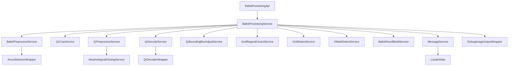

# `szavazas-core` compliance refactor plan

## Objective

Refactor [`szavazas-core`](../szavazas-core) for strict compliance with the Konveyor rules in [`AGENTS.md`](../AGENTS.md:1), prioritising rule adherence over backward compatibility.

## Planning assumptions

- Public APIs such as [`BallotProcessingApi`](../szavazas-core/src/main/java/hu/kdea/szavazas/ballotprocessor/BallotProcessingApi.java:6) and [`QrProcessingApi`](../szavazas-core/src/main/java/hu/kdea/szavazas/ballotprocessor/qr/QrProcessingApi.java:5) may change if needed for strict compliance.
- Legacy classes such as [`BallotProcessor`](../szavazas-core/src/main/java/hu/kdea/szavazas/ballotprocessor/BallotProcessor.java:27), [`LegacyBallotProcessorApiAdapter`](../szavazas-core/src/main/java/hu/kdea/szavazas/ballotprocessor/LegacyBallotProcessorApiAdapter.java:10), and [`LegacyQrProcessorApiAdapter`](../szavazas-core/src/main/java/hu/kdea/szavazas/ballotprocessor/qr/LegacyQrProcessorApiAdapter.java:8) are candidates for deletion or replacement.
- The target architecture should use Dagger constructor injection consistently, as already supported by [`szavazas-core/build.gradle.kts`](../szavazas-core/build.gradle.kts:17).

## Critical-violation remediation plan

### Critical violation 1: monolithic orchestration outside compliant services

Primary offenders

- [`BallotProcessor`](../szavazas-core/src/main/java/hu/kdea/szavazas/ballotprocessor/BallotProcessor.java:24)
- [`GridDetectionOrchestrator`](../szavazas-core/src/main/java/hu/kdea/szavazas/ballotprocessor/grid/GridDetectionOrchestrator.java:20)
- [`XDetector`](../szavazas-core/src/main/java/hu/kdea/szavazas/ballotprocessor/x/XDetector.java:13)
- [`GridRegionExtractor`](../szavazas-core/src/main/java/hu/kdea/szavazas/ballotprocessor/grid/GridRegionExtractor.java:10)
- [`QRDetectorStep`](../szavazas-core/src/main/java/hu/kdea/szavazas/ballotprocessor/qr/QRDetectorStep.java:8)

Remediation steps

1. Make [`BallotProcessingService.apply()`](../szavazas-core/src/main/java/hu/kdea/szavazas/ballotprocessor/BallotProcessingService.java:21) the single production ballot orchestration entrypoint.
2. Delete business orchestration from [`BallotProcessor`](../szavazas-core/src/main/java/hu/kdea/szavazas/ballotprocessor/BallotProcessor.java:24) and replace callers with service-driven APIs.
3. Extract each major step into a dedicated `*Service` with one public `apply` method.
4. Move grid math, QR polling, crop preprocessing, X-mark analysis, and result building out of non-service classes into small service units.
5. Keep support classes only as thin wrappers, data records, constants, or glue.

Target replacement units

- `BallotPreprocessService`
- `QrCropService`
- `QrDetectService`
- `GridRegionExtractService`
- `GridDetectService`
- `XMarkDetectService`
- `BallotResultBuildService`

### Critical violation 2: unsupported production categories and naming

Primary offenders

- [`XMarkDetectorStep`](../szavazas-core/src/main/java/hu/kdea/szavazas/ballotprocessor/x/XMarkDetectorStep.java:12)
- [`GridDetectorStep`](../szavazas-core/src/main/java/hu/kdea/szavazas/ballotprocessor/grid/GridDetectorStep.java:9)
- [`QRPreprocessingPipeline`](../szavazas-core/src/main/java/hu/kdea/szavazas/ballotprocessor/qr/preprocess/QRPreprocessingPipeline.java:7)
- [`DefaultBallotProcessorFactory`](../szavazas-core/src/main/java/hu/kdea/szavazas/ballotprocessor/DefaultBallotProcessorFactory.java:13)
- [`LegacyBallotProcessorApiAdapter`](../szavazas-core/src/main/java/hu/kdea/szavazas/ballotprocessor/LegacyBallotProcessorApiAdapter.java:7)
- [`LegacyQrProcessorApiAdapter`](../szavazas-core/src/main/java/hu/kdea/szavazas/ballotprocessor/qr/LegacyQrProcessorApiAdapter.java:6)
- [`DrawingUtils`](../szavazas-core/src/main/java/hu/kdea/szavazas/ballotprocessor/debug/DrawingUtils.java:6)

Remediation steps

1. Replace all `*Step`, `*Pipeline`, `*Factory`, `*Adapter`, `*Detector`, `*Orchestrator`, and `*Utils` business units with allowed categories.
2. Rename surviving business units to `*Service` only when they actually satisfy the service rules.
3. Reclassify external integration units as `*Wrapper` only if they become thin bridges.
4. Reclassify framework entrypoints under glue only.
5. Delete categories that cannot be made compliant without carrying business logic in the wrong place.

Category decisions

- Business sequencing becomes `*Service`
- Library bridges become `*Wrapper`
- Framework wiring remains Glue
- Immutable carriers become `*Data`
- Hard-coded constants become `*Constants`

### Critical violation 3: direct object construction and non-DI constructors

Primary offenders

- [`BallotProcessor`](../szavazas-core/src/main/java/hu/kdea/szavazas/ballotprocessor/BallotProcessor.java:35)
- [`BallotPreprocessor`](../szavazas-core/src/main/java/hu/kdea/szavazas/ballotprocessor/BallotPreprocessor.java:24)
- [`ArucoDetectorWrapper`](../szavazas-core/src/main/java/hu/kdea/szavazas/ballotprocessor/aruco/ArucoDetectorWrapper.java:13)
- [`SzavazasCoreModule`](../szavazas-core/src/main/java/hu/kdea/szavazas/ballotprocessor/glue/SzavazasCoreModule.java:21)

Remediation steps

1. Remove constructors that assemble object graphs or choose concrete collaborators.
2. Keep constructors only for dependency assignment, using `@Inject` where appropriate.
3. Push all construction choices into Dagger wiring or delete them if glue can bind constructor-injectable types directly.
4. Replace `new` calls inside production business code with injected collaborators.
5. Remove overload-heavy convenience constructors from production logic classes.

Target DI shape

- Services use constructor injection only.
- Wrappers use constructor injection only.
- Glue performs binding only, not business composition.
- No production class constructs services, wrappers, state, or helper pipelines directly.

### Critical violation 4: thick wrappers with business logic

Primary offenders

- [`ArucoDetectorWrapper`](../szavazas-core/src/main/java/hu/kdea/szavazas/ballotprocessor/aruco/ArucoDetectorWrapper.java:9)
- [`MorphologicalClosingWrapper`](../szavazas-core/src/main/java/hu/kdea/szavazas/ballotprocessor/qr/preprocess/MorphologicalClosingWrapper.java:7)
- [`QrDecoderWrapper`](../szavazas-core/src/main/java/hu/kdea/szavazas/ballotprocessor/qr/QrDecoderWrapper.java:15)

Remediation steps

1. Limit wrappers to third-party API calls and format conversion only.
2. Move control flow, fallbacks, retries, thresholds, and business interpretations into services.
3. Remove internal collaborator creation from wrappers.
4. Keep wrapper APIs minimal and deterministic.
5. Add corresponding stubs later for test compliance.

Wrapper boundary rules for the refactor

- No domain branching inside wrappers.
- No orchestration inside wrappers.
- No creation of other project units inside wrappers.
- Only external library bridging, parameter mapping, and returned raw data transfer.

### Critical violation 5: non-compliant data carriers

Primary offenders

- [`BallotResult`](../szavazas-core/src/main/java/hu/kdea/szavazas/ballotprocessor/BallotResult.java:6)
- [`PreprocessResult`](../szavazas-core/src/main/java/hu/kdea/szavazas/ballotprocessor/PreprocessResult.java:5)
- [`QrResult`](../szavazas-core/src/main/java/hu/kdea/szavazas/ballotprocessor/qr/QrResult.java:5)
- [`QrData`](../szavazas-core/src/main/java/hu/kdea/szavazas/ballotprocessor/qr/QrData.java:5)
- [`GridRegion`](../szavazas-core/src/main/java/hu/kdea/szavazas/ballotprocessor/grid/GridRegion.java:5)
- [`GridDetectionResult`](../szavazas-core/src/main/java/hu/kdea/szavazas/ballotprocessor/grid/GridDetectionResult.java:7)
- [`ProjectionData`](../szavazas-core/src/main/java/hu/kdea/szavazas/ballotprocessor/projection/ProjectionData.java:3)
- [`AxisPeaks`](../szavazas-core/src/main/java/hu/kdea/szavazas/ballotprocessor/projection/AxisPeaks.java:6)
- [`Rect`](../szavazas-core/src/main/java/hu/kdea/szavazas/ballotprocessor/common/Rect.java:5)
- [`Point`](../szavazas-core/src/main/java/hu/kdea/szavazas/ballotprocessor/common/Point.java:5)
- [`CellDebugData`](../szavazas-core/src/main/java/hu/kdea/szavazas/ballotprocessor/x/CellDebugData.java:8)
- [`QrCropResultData`](../szavazas-core/src/main/java/hu/kdea/szavazas/ballotprocessor/qr/QrCropResultData.java:6)
- [`XMarkDetectionResultData`](../szavazas-core/src/main/java/hu/kdea/szavazas/ballotprocessor/x/XMarkDetectionResultData.java:9)

Remediation steps

1. Convert immutable transport objects into records ending with `Data`.
2. Remove methods from `record` data units and relocate helper logic into services.
3. Delete legacy duplicate carriers when a compliant `Data` record exists.
4. Ensure collection fields are created with immutable collections.
5. Update all call sites to use record accessors instead of getter methods.

Conversion map

- `BallotResult` -> `BallotResultData`
- `PreprocessResult` -> `PreprocessResultData`
- `QrResult` -> `QrResultData`
- `QrData` -> `QrResultData` or a new compliant domain record if both concepts must remain distinct
- `GridRegion` -> `GridRegionData`
- `GridDetectionResult` -> `GridDetectionResultData`
- `Rect` -> `RectData`
- `Point` -> `PointData`
- `CellDebugData` stays a record but loses helper logic if added later elsewhere

## Target architecture

### 1. Replace monolithic orchestration with micro services

The current orchestration in [`BallotProcessor.process()`](../szavazas-core/src/main/java/hu/kdea/szavazas/ballotprocessor/BallotProcessor.java:54) should be decomposed into small Service units, each with exactly one public [`apply`](../szavazas-core/src/main/java/hu/kdea/szavazas/ballotprocessor/qr/preprocess/MorphologicalClosingService.java:15) method and constructor-injected dependencies.

Proposed production units

- `BallotPreprocessService`
- `QrCropService`
- `QrPreprocessService`
- `QrDecodeService`
- `QrBoundingBoxAdjustService`
- `GridRegionExtractService`
- `GridDetectService`
- `XMarkDetectService`
- `BallotResultBuildService`
- `BallotProcessingService`
- `QrProcessingService`

Each service should remain below the 25 LoC threshold by pushing calculations and external behaviour into dedicated collaborators.

### 2. Introduce explicit wrapper boundaries

Current wrapper-like abstractions are inconsistent. [`DebugImageOutputWrapper`](../szavazas-core/src/main/java/hu/kdea/szavazas/ballotprocessor/debug/DebugImageOutputWrapper.java:6) is an interface, while [`MorphologicalClosingWrapper`](../szavazas-core/src/main/java/hu/kdea/szavazas/ballotprocessor/qr/preprocess/MorphologicalClosingWrapper.java:7) contains actual logic.

Refactor direction

- Replace interface-based wrapper naming with concrete injectable Wrapper classes.
- Restrict Wrapper units to external-library bridging only.
- Move domain decisions and sequencing out of wrappers into services.

Proposed wrapper units

- `QrDecoderWrapper` wrapping ZXing calls now hidden behind [`IQRProcessor`](../szavazas-core/src/main/java/hu/kdea/szavazas/ballotprocessor/qr/IQRProcessor.java)
- `ArucoDetectorWrapper` wrapping BoofCV marker detection now hidden behind [`IArucoDetector`](../szavazas-core/src/main/java/hu/kdea/szavazas/ballotprocessor/aruco/IArucoDetector.java)
- `MorphologicalClosingWrapper` retained only if it is reduced to a thin library bridge
- `DebugImageOutputWrapper` converted from interface to class or replaced by a better-named concrete wrapper

### 3. Replace legacy adapters with compliant glue or delegates

[`LegacyBallotProcessorApiAdapter`](../szavazas-core/src/main/java/hu/kdea/szavazas/ballotprocessor/LegacyBallotProcessorApiAdapter.java:10) and [`LegacyQrProcessorApiAdapter`](../szavazas-core/src/main/java/hu/kdea/szavazas/ballotprocessor/qr/LegacyQrProcessorApiAdapter.java:8) should not survive in their current form.

Refactor direction

- Remove reflection-based extraction.
- Remove callback-to-blocking adaptation logic from production business classes.
- Define stable, synchronous service-oriented APIs that return `Data` outcomes directly.
- Keep any framework entrypoint as Glue only, with no business logic.

Proposed API shape

- [`BallotProcessingApi`](../szavazas-core/src/main/java/hu/kdea/szavazas/ballotprocessor/BallotProcessingApi.java:6) remains an interface if it is a domain port.
- [`QrProcessingApi`](../szavazas-core/src/main/java/hu/kdea/szavazas/ballotprocessor/qr/QrProcessingApi.java:5) remains an interface if it is a domain port.
- Provide `DefaultBallotProcessingApi` and `DefaultQrProcessingApi` as injectable Delegate or Glue-facing implementations depending on final integration needs.

### 4. Normalise data and outcome modelling

The existing `record` types such as [`QrProcessingOutcomeData`](../szavazas-core/src/main/java/hu/kdea/szavazas/ballotprocessor/qr/QrProcessingOutcomeData.java:3) are already directionally correct.

Refactor direction

- Keep `record`-based `Data` units.
- Remove older mutable or non-Data transport classes where equivalent `Data` records exist.
- Rename non-compliant domain carriers ending without `Data` where they represent immutable value objects.
- Ensure collections inside data records are immutable at creation time.

### 5. Add required i18n infrastructure

User-facing messages currently embedded in [`BallotProcessor.process()`](../szavazas-core/src/main/java/hu/kdea/szavazas/ballotprocessor/BallotProcessor.java:54) must be externalised.

Required additions

- `LocaleState`
- `MessageService`
- [`messages.properties`](../szavazas-core/src/main/resources/messages.properties)

Refactor direction

- Replace user-visible inline strings with message keys resolved through `MessageService` plus `LocaleState`.
- Keep exception and log text non-i18n if they are not user-visible.

### 6. Add Dagger glue for composition

There is no visible compliant Dagger composition root yet.

Required Glue units

- `BallotProcessorModule`
- `QrProcessorModule`
- `SzavazasCoreComponent`

Refactor direction

- Use Dagger modules and components only for wiring.
- Keep all business logic outside modules.
- Constructor injection remains the default for concrete units.

## Suggested dependency flow

## Migration strategy

### Phase 1. Establish compliant primitives

- Introduce missing `State`, `Wrapper`, `Glue`, and service classes without changing all call sites immediately.
- Add i18n primitives and Dagger wiring.
- Define the new synchronous service contracts and target `Data` outcomes.

### Phase 2. Extract behaviour out of [`BallotProcessor`](../szavazas-core/src/main/java/hu/kdea/szavazas/ballotprocessor/BallotProcessor.java:27)

- Extract one responsibility at a time into new `*Service` units.
- Replace field initialisation and constructor assembly with constructor-injected collaborators.
- Delete duplicated orchestration once `BallotProcessingService` becomes the only business entrypoint.

### Phase 3. Collapse legacy abstraction layers

- Remove [`LegacyBallotProcessorApiAdapter`](../szavazas-core/src/main/java/hu/kdea/szavazas/ballotprocessor/LegacyBallotProcessorApiAdapter.java:10).
- Remove [`LegacyQrProcessorApiAdapter`](../szavazas-core/src/main/java/hu/kdea/szavazas/ballotprocessor/qr/LegacyQrProcessorApiAdapter.java:8).
- Replace [`IQRProcessor`](../szavazas-core/src/main/java/hu/kdea/szavazas/ballotprocessor/qr/IQRProcessor.java) and [`IArucoDetector`](../szavazas-core/src/main/java/hu/kdea/szavazas/ballotprocessor/aruco/IArucoDetector.java) if they do not fit the final Wrapper or API boundary model.

### Phase 4. Delete or rename non-compliant production units

- Remove non-compliant classes that encode logic outside services.
- Rename survivors to match mandatory suffixes such as `Service`, `Wrapper`, `State`, `Repository`, `Constants`, and `Data`.
- Ensure no production file contains business logic in adapters, wrappers, or glue.

## Risks and design decisions

- Strict compliance may require replacing currently convenient callback-based APIs with direct return-value services.
- Some existing helper classes in [`szavazas-core/src/main/java`](../szavazas-core/src/main/java) may need reclassification or splitting even if functionally correct.
- The 25 LoC service limit will force additional extraction of arithmetic and transformation steps into many small units.
- If a class cannot be made compliant within its current name and role, deletion and recreation is cleaner than incremental patching.

## Implementation todo list

- [ ] Inventory all production Java units in [`szavazas-core/src/main/java`](../szavazas-core/src/main/java) by target category: Service, Wrapper, Data, Constants, State, Repository, Delegate, Glue
- [ ] Remove business orchestration from [`BallotProcessor`](../szavazas-core/src/main/java/hu/kdea/szavazas/ballotprocessor/BallotProcessor.java:24) and make [`BallotProcessingService`](../szavazas-core/src/main/java/hu/kdea/szavazas/ballotprocessor/BallotProcessingService.java:9) the only ballot entry service
- [ ] Replace `*Step`, `*Detector`, `*Pipeline`, `*Factory`, `*Adapter`, `*Orchestrator`, and `*Utils` business units with allowed categories
- [ ] Remove direct `new`-based collaborator construction from production business code and normalize constructor injection
- [ ] Reduce [`ArucoDetectorWrapper`](../szavazas-core/src/main/java/hu/kdea/szavazas/ballotprocessor/aruco/ArucoDetectorWrapper.java:9), [`MorphologicalClosingWrapper`](../szavazas-core/src/main/java/hu/kdea/szavazas/ballotprocessor/qr/preprocess/MorphologicalClosingWrapper.java:7), and [`QrDecoderWrapper`](../szavazas-core/src/main/java/hu/kdea/szavazas/ballotprocessor/qr/QrDecoderWrapper.java:15) to thin library bridges only
- [ ] Convert legacy immutable carriers into record-based `*Data` units and remove methods from `record` data units such as [`QrCropResultData`](../szavazas-core/src/main/java/hu/kdea/szavazas/ballotprocessor/qr/QrCropResultData.java:6) and [`XMarkDetectionResultData`](../szavazas-core/src/main/java/hu/kdea/szavazas/ballotprocessor/x/XMarkDetectionResultData.java:9)
- [ ] Add i18n infrastructure: `LocaleState`, `MessageService`, and [`messages.properties`](../szavazas-core/src/main/resources/messages.properties)
- [ ] Add Dagger Glue units for the new composition root
- [ ] Verify every service has one public `apply` method, constructor injection only, and under-25-LoC bodies
- [ ] Verify every wrapper is a concrete injectable wrapper with no business logic
- [ ] Verify all user-visible strings resolve through i18n services
- [ ] Run a final compliance pass across the entire production tree
