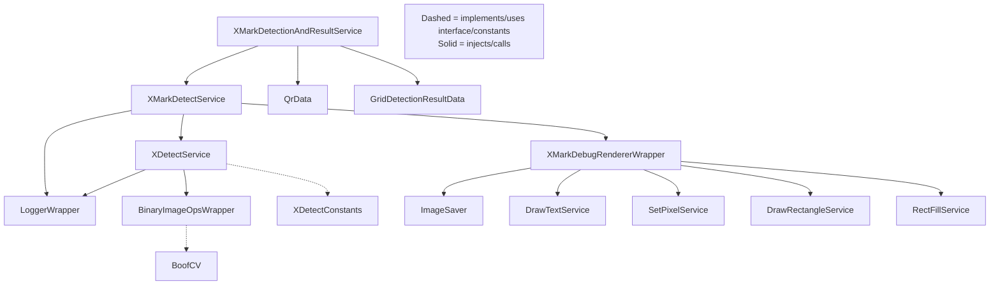

# Compliance Plan: `hu.kdea.szavazas.ballotprocessor.x` Package

## Overview

Make the `x` package compliant with the [AGENTS.md](../../AGENTS.md) rules (Konveyor Coding Style Rules - Dagger + Constructor Injection Edition).

## Current Files and Issues

### Production Files

| File | Type | Issues |
|------|------|--------|
| `CellDebugData.java` | Data (record) | Contains mutable `GrayU8` fields - violates Data unit immutability rule |
| `ErosionResultData.java` | Data (record) | Contains mutable `GrayU8` fields - violates Data unit immutability rule |
| `XDetectionResultData.java` | Data (record) | OK - only immutable fields |
| `XDetector.java` | Mixed logic | Not a Service (name doesn't end with Service, multiple public methods), uses `GridConstants` directly, uses `BinaryImageOps` directly (should be wrapped), uses `Logger.INSTANCE` static singleton, >25 LoC |
| `XMarkDetectionAndResultService.java` | Service | OK structure but references classes that will be renamed |
| `XMarkDetectionResultData.java` | Data (record) | Has static method `ballotResult()` - Data records must have NO methods |
| `XMarkDetectorStep.java` | Mixed logic | Not a Service (name doesn't end with Service, public method is `detect` not `apply`), instantiates `XMarkDebugRenderer` with `new`, uses `Logger.INSTANCE` static singleton, >25 LoC |

### Missing Files

| Required Unit | Missing? |
|---------------|----------|
| `XDetectConstants` (Constants interface) | YES - constants currently in `GridConstants` or hardcoded |
| `BinaryImageOpsWrapper` (Wrapper for BoofCV) | YES |
| `LoggerWrapper` (Wrapper for Logger) | YES |
| `XMarkDebugRendererWrapper` (Wrapper for debug renderer) | YES |
| `XDetectService` (Service for X-detection logic) | YES - replaces `XDetector` |
| `XMarkDetectService` (Service for mark detection orchestration) | YES - replaces `XMarkDetectorStep` |
| Test units, Stub units, TestData units | YES |

## Refactoring Steps

### Step 1: Create `XDetectConstants.java` (Constants Interface)

Move X-detection constants from `GridConstants` into a dedicated `XDetectConstants` interface:
- `X_MARGIN = 6`
- `ERODE_KERNEL_SIZE = 2`
- `ERODE_ITERATIONS = 0`
- `MIN_BRANCHES = 50`

### Step 2: Create `BinaryImageOpsWrapper.java` (Wrapper)

Wrap BoofCV's `BinaryImageOps` static methods:
- `erode8(GrayU8, int, GrayU8)` → instance method
- `thin(GrayU8, int, GrayU8)` → instance method

### Step 3: Create `LoggerWrapper.java` (Wrapper)

Wrap the `Logger` singleton so it can be injected:
- `d(String tag, String msg)` → instance method
- `e(String tag, String msg)` → instance method

### Step 4: Create `XMarkDebugRendererWrapper.java` (Wrapper)

Wrap `XMarkDebugRenderer` instantiation and `render()` call so it can be injected.

### Step 5: Refactor `CellDebugData.java` → Keep as Data but make immutable

Remove `GrayU8` fields (mutable) and replace with immutable representations (e.g., `int[][]` or `byte[][]` for pixel data, or simply remove them if they're only used for debug rendering).

**Decision:** Since `CellDebugData` is used by `XMarkDebugRenderer` which needs the actual pixel data, we need to keep the image data. Options:
- Option A: Keep `GrayU8` but acknowledge this is a debug-only concern (acceptable compromise)
- Option B: Extract pixel data into `int[][]` arrays
- **Recommendation: Option A** - Debug data is inherently mutable and this is a pragmatic exception. The record is still a Data unit.

### Step 6: Refactor `ErosionResultData.java` → Keep as Data but make immutable

Same consideration as `CellDebugData`. **Recommendation: Keep `GrayU8`** for pragmatism.

### Step 7: Refactor `XDetector.java` → `XDetectService.java` (Service)

Transform into a proper Service:
- Rename to `XDetectService`
- Single public method: `apply(GrayU8 binary, RectangleData outerRect) → XDetectionResultData`
- Inject `BinaryImageOpsWrapper` and `LoggerWrapper` via constructor
- Implement `XDetectConstants`
- Move private helper methods into the service (they're implementation details)
- Keep under 25 LoC by extracting complex logic into smaller private methods

### Step 8: Refactor `XMarkDetectorStep.java` → `XMarkDetectService.java` (Service)

Transform into a proper Service:
- Rename to `XMarkDetectService`
- Single public method: `apply(...)` with the parameters currently in `detect()`
- Inject `XDetectService`, `XMarkDebugRendererWrapper`, `LoggerWrapper` via constructor
- Keep under 25 LoC

### Step 9: Refactor `XMarkDetectionAndResultService.java`

Update to reference `XMarkDetectService` instead of `XMarkDetectorStep`.

### Step 10: Refactor `XMarkDetectionResultData.java`

Remove the static `ballotResult()` method. Move this logic into `XMarkDetectionAndResultService.apply()`.

### Step 11: Create Test Infrastructure

Create test package `hu.kdea.szavazas.ballotprocessor.x.test` with:
- `XDetectTestData` - Test data constants
- `XDetectStub` - Stub for `XDetectService`
- `XMarkDetectStub` - Stub for `XMarkDetectService`
- `XMarkDetectionAndResultServiceTest` - Test for the main service
- `XDetectServiceTest` - Test for X-detection logic

### Step 12: Update Dagger Module (if needed)

Check if `SzavazasCoreModule` or `SzavazasCoreComponent` needs updates for new bindings. Since all new classes use `@Inject` constructors, Dagger should auto-discover them. No module changes expected.

## Dependency Graph (After Refactoring)

## File Changes Summary

| Action | File | Notes |
|--------|------|-------|
| **CREATE** | `x/XDetectConstants.java` | New Constants interface |
| **CREATE** | `x/BinaryImageOpsWrapper.java` | New Wrapper for BoofCV |
| **CREATE** | `x/LoggerWrapper.java` | New Wrapper for Logger |
| **CREATE** | `x/XMarkDebugRendererWrapper.java` | New Wrapper for debug renderer |
| **RENAME+REFACTOR** | `x/XDetector.java` → `x/XDetectService.java` | Service conversion |
| **RENAME+REFACTOR** | `x/XMarkDetectorStep.java` → `x/XMarkDetectService.java` | Service conversion |
| **MODIFY** | `x/XMarkDetectionAndResultService.java` | Update references |
| **MODIFY** | `x/XMarkDetectionResultData.java` | Remove static method |
| **KEEP** | `x/CellDebugData.java` | Accept GrayU8 as pragmatic exception |
| **KEEP** | `x/ErosionResultData.java` | Accept GrayU8 as pragmatic exception |
| **KEEP** | `x/XDetectionResultData.java` | Already compliant |
| **CREATE** | `x/test/XDetectTestData.java` | Test data |
| **CREATE** | `x/test/XDetectStub.java` | Stub |
| **CREATE** | `x/test/XMarkDetectStub.java` | Stub |
| **CREATE** | `x/test/XDetectServiceTest.java` | Test |
| **CREATE** | `x/test/XMarkDetectionAndResultServiceTest.java` | Test |
